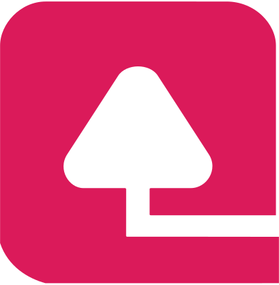

### Hi there Welcome to DavitTec

## Find me around somewhere 🌎: 
- We are in the public domain <a href="https://www.twitch.tv/DavitTec">Twitch</a> 
- DAVIT <a href="https://www.davit.ie">Davit.ie</a>
- Interactions on <a href="https://codepen.io/DavitTec"> Codepen</a>
- Sharing updates on Davit via <a href="https://www.linkedin.com/company/davit/">LinkedIn</a>
- `` cant adjust size here ![Davit][davit-logo]`` use 

<!--
**DavitTec/DavitTec** is a ✨ _special_ ✨ repository because its `README.md` (this file) appears on your GitHub profile.

Here are some ideas to get you started:

- 🔭 I’m currently working on 

- 🌱 I’m currently learning ...

- 👯 I’m looking to collaborate on ...

- 🤔 I’m looking for help with ...

- 💬 Ask me about ...

- 📫 How to reach me: ...

- 😄 Pronouns: ...

- ⚡ Fun fact: ...
-->

## Support me

----
[davit-logo]:https://github.com/DavitTec/DavitTec/blob/master/logo/logo.svg
